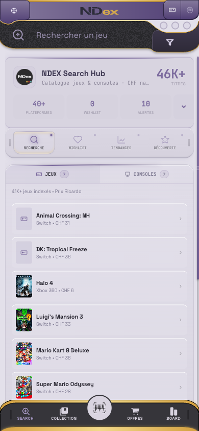
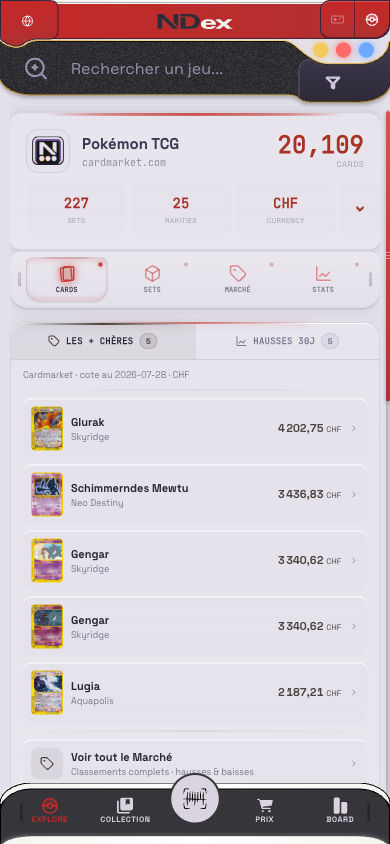
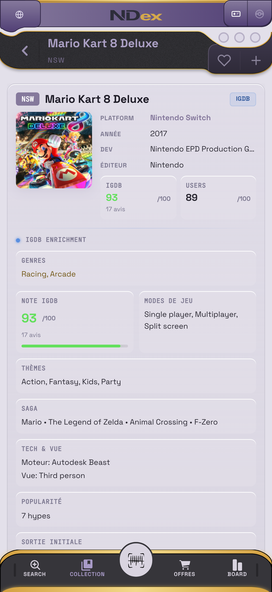

# Retromorphism

**A UI that behaves like a device, not like paper.**

Not skeuomorphism — nothing here pretends to be leather or brushed steel. Not
neumorphism either: no soft extruded blobs, no shadow-only hierarchy. The
premise is narrower and older. A screen is a **panel set into a moulded shell**:
it has frames, notches, status lights and a bezel, and depth comes from
structure rather than from blur.

The values here are read out of two codebases that use them, rather than picked
for a palette. Where the two disagree, that is written down rather than averaged
away.

## One language, two dialects

Retromorphism was born on **NDEX** — a Swiss price index for retro games and
Pokémon cards. It was designed there, for a product that shows numbers about
objects people collect. **Memoria adopted it afterwards**, for something else
entirely: an instrument that shows the shape of a knowledge base.

That order matters, and it is the whole interest of the thing. A design language
that only ever dressed the product it was made for has proved nothing. This one
was ported to an appliance of a different nature, and it survived — but it did
not survive unchanged, and pretending otherwise would be the easy lie.

So this repository is deliberately in two layers:

- **The core** — what holds in both, verified in both codebases at the same
  value: the palette, the four principles, and the seventeen rules. These are
  mechanics, not a look. They transfer.
- **The two dialects** — where the appliances legitimately differ. NDEX draws a
  `1px` frame, Memoria a `2px` one. NDEX's diodes breathe by design; Memoria's
  chrome stopped moving on purpose. NDEX forbids the hexagon; in Memoria the
  hexagon is what carries the count. None of these is a drift to be corrected:
  they are two devices, and a language that produces one device is a template.

Every claim below says which layer it belongs to. A value with no dialect marker
is one that both codebases resolve identically.


---

## The measured core

Thirteen values appear in both codebases at the same hex, reached separately
over several months. **Six in the light themes, seven in the dark** — and the
dark ones are the stronger signal, because dark palettes are where most systems
drift apart.

An earlier revision of this table put `--rm-gold` and `--rm-alert` under
*Light* and counted eight against five. Both are dark-theme values: in the light
theme Memoria resolves them to `#7B5C0A` and `#B01A1A`
(`contenu/scripts/memoria_theme.py:50-51` against `:63-64`). The count followed
the mistake.

**Light**

| Token | Value | NDEX | Memoria |
|---|---|---|---|
| `--rm-amber` | `#E2B84E` | `retro-accent` | `--amber` |
| `--rm-violet-muted` | `#7C6B9E` | `accent-muted` | `--accent` |
| `--rm-ink` | `#2A2832` | `text-1` | `--text` |
| `--rm-ink-muted` | `#5A5370` | `text-3` | `--muted` |
| `--rm-ink-faint` | `#7C7890` | `text-2` | `--faint` |
| `--rm-rule` | `#A8A0BC` | `border-2` | `--line` |

**Dark**

| Token | Value | NDEX | Memoria |
|---|---|---|---|
| `--rm-bg-dark` | `#1E1D24` | `app-bg` | `--bg` |
| `--rm-rule-dark` | `#4F4764` | `border-1` | `--line` |
| `--rm-rule-2-dark` | `#3A3845` | `border-2` | `--line2` |
| `--rm-accent-dark` | `#9B74F2` | `retro-accent` | `--accent` |
| `--rm-ink-dark` | `rgba(255,255,255,.90)` | `text-1` | `--text` |
| `--rm-gold` | `#D4A84C` | `accent-gold` | `--kraft` |
| `--rm-alert` | `#FF6B6B` | `diode-red` | `--warn` |

## Where the two dialects part

Measured on 2026-08-01, both codebases open side by side. These are not bugs on
either side — each is right for its appliance.

| Trait | NDEX (origin) | Memoria (adopter) |
|---|---|---|
| Frame | `1px solid #000` | `2px solid var(--outline)` — no `1px` frame anywhere |
| Diode | 16px, 8px gap | 6, 8 or 9px; no 12px diode exists |
| Movement | diodes breathe: 2000 ms loop, 1000 ms on alert | chrome stopped moving on 2026-07-31, on purpose |
| Hexagon | forbidden | carries the count, `clip-path` on 6 points |
| Corner radii | `6px 6px 14px 14px` on the tab bar | families of `16/16/22/22`, `18/18/12/12` |
| Accent | `#C6403C` light / `#D0524E` dark | `--accent`, permuted per theme |

The reason to publish this table rather than smooth it over: the repository's own
test — strip the colour, keep frames, grooves and radii, and ask whether it still
reads as one appliance — returns **two**. A language honest about that is usable.
One that hides it produces the third thing nobody wants: a template that fits
neither product.

## The four principles

**Matter over shadow.** Depth is built from surface levels and frames, not from
drop shadows. Four levels.

The inversion — dark shells *inside* a light canvas — is the **light theme
only**, and it is worth naming because the light theme is not what either
product runs. In the dark theme both stack dark-on-dark and the inversion does
not exist: Memoria goes `--bg #1E1D24` → `--pane #252430`, NDEX goes surface-0
`#1E1D24` → s1 `#28272E` → s2 `#2A2735`. A principle that only holds in the
theme nobody uses is a principle about a drawing, not about a device.

```
canvas #E3E0EA  ← the page
  s1   #D9D4E0  ← cards, panels
    s2 #36353A  ← dark shells: search, tabs, footer
      s3 #27262A ← grooves, dividers
```

**Two type registers, never three.** A grotesque to read; a monospace in small
caps with wide tracking (0.12–0.22em) to label. The monospace label is what
says *instrument* rather than *website*.

**Asymmetric radii by position.** A module on the left is not a module on the
right. `16px 8px 32px 16px` on the left, `8px` in the centre, mirrored on the
right — the shell is moulded, not tiled.

**Status before text.** Diodes carry state at a glance:
gold / red / blue / off. The label explains; the diode is read first.

## Two worlds, one frame

Both interfaces permute a **hue** per context and change nothing else — not the
radii, not the type, not the structure. That constraint is what makes the two
modes read as the same device:

| | Games | Pokémon |
|---|---|---|
| chrome | `#85799C → #513F75` | `#C62828 → #B03030` |
| accent | `#7C6B9E` | `#C6403C` light / `#D0524E` dark |

| Games | Pokémon | Detail |
|---|---|---|
|  |  |  |

## Anatomy

Six pieces — slot, module, diodes, moulded shell, identity zone, box variants —
each cropped from a running interface and followed by the recipe that produces
it. Then the five **motifs** that recur at every scale and make it a language
rather than a component list: the fading rail, the tint ladder, the double
frame, the bevel pair, asymmetric radii.
→ [docs/anatomy.md](docs/anatomy.md)


## Dark

Both interfaces run dark, and dark is where the language is most itself: the
shell recedes, the screens carry the signal, the diodes do the talking.

| Memoria | NDEX · Pokémon | NDEX · Games |
|---|---|---|
|  |  |  |

## Rules that cost something to learn

Seventeen of them, each with what was tried first and why it failed. →
[docs/rules.md](docs/rules.md)

**Cap the highlight.** A selected state never exceeds **1.4×** the resting
luminance, and nothing flashes. An element that pulses is looked at once and
then filtered out permanently.

**Contrast by warmth, not by brightness.** Making an element lighter to detach
it turns it into a sticker. Detach it with warm rim-light in the accent family
and keep it dark — three failed attempts confirmed this in a single evening.

**`letter-spacing` breaks centring.** SVG adds a gutter after *every* glyph,
including the last, so `text-anchor="middle"` lands half a gutter left. Uneven
tracking across lines makes a block look chipped rather than off-centre.
Compensate with `dx` equal to half the tracking, per line.

**Structural devices must encode something true.** Numbered markers only if the
content is a sequence. A groove only where two modules actually meet.

**Screens are the one place saturation is allowed.** Deep navy ground, phosphor
text. Everywhere else, saturation is a mistake.

## Files

```
tokens/core.json     the measured core, W3C design-tokens shape
tokens/themes.json   per-product, per-theme values
tokens/core.css      custom properties, written by hand alongside core.json
docs/anatomy.md      the six pieces, each with its recipe
docs/rules.md        seventeen rules, each with the failure that produced it
docs/principles.md   what this is and is not
assets/              parts cropped from the running interfaces
```

## Take it

The tokens are MIT. Copy them, fork them, ship them in something of your own —
no permission needed and none expected back.

Anyone can screenshot an interface and rebuild its look; that has always been
true and tooling has only made it faster. So the useful thing to publish is not
the pixels but the **vocabulary**: named values, the reasons behind them, and a
date. What is worth keeping is the name and the origin, which is why both are
written down here rather than defended.

If you build something in this language, `retromorphism` is what to call it.

## Where this comes from

The name and the first written rules date from February 2026, in one of the two
codebases; the other reached the same core on its own. This repo is the
extraction, dated 2026-07-29: values were read from the source and from computed
styles, not retyped from memory.

Both codebases are private, so the tokens travel and the implementations do not.
That is the limit of what this can be, and it is stated here rather than
implied.

— Yyunozor, 2026-07-29

---

## Reproducing this by machine

[`docs/agentic.md`](docs/agentic.md) — what happened when an agent was asked to
build in this style from the sources alone. Short version: reading a source
codebase yields the palette and loses the grammar; the token file is what
carries the parts that are not colours. Includes a proposed addition to the
anatomy, the **specification plate**.
