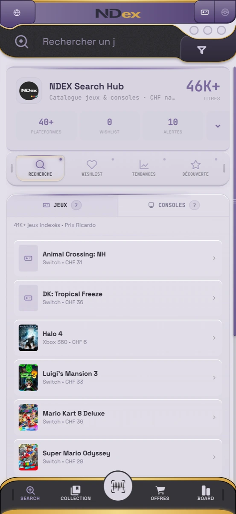
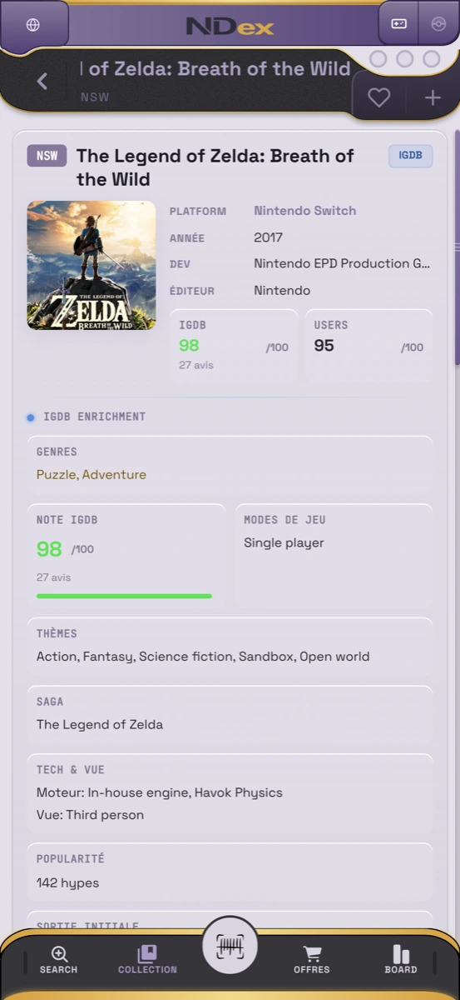
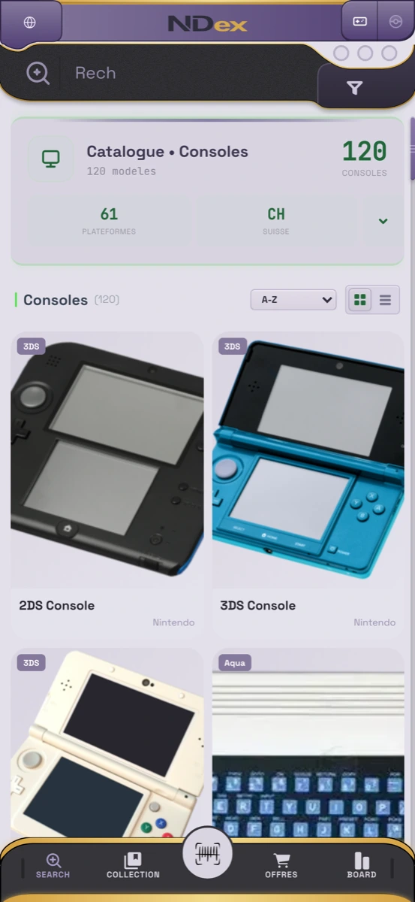
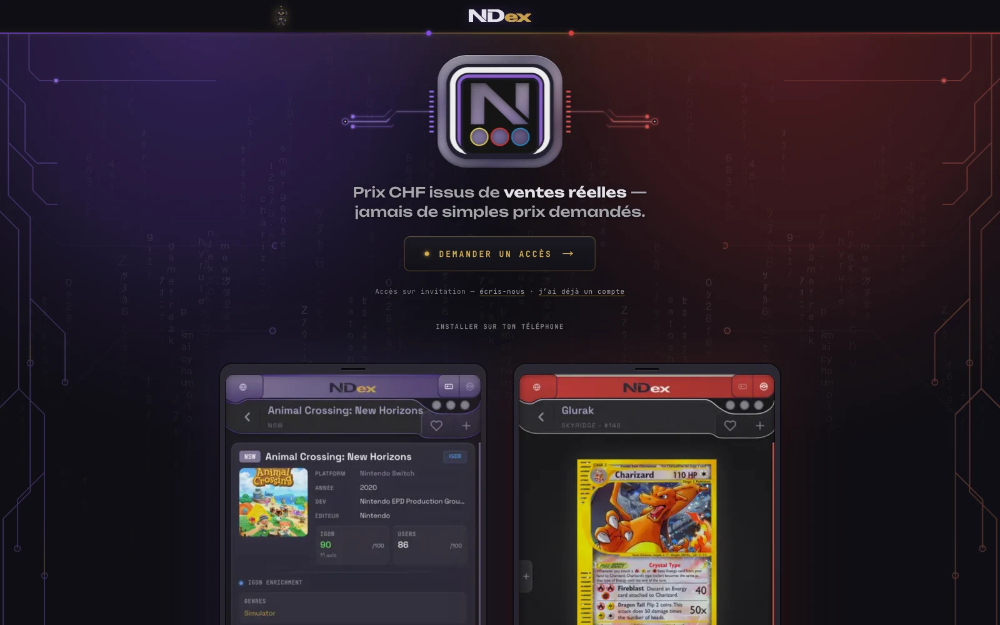
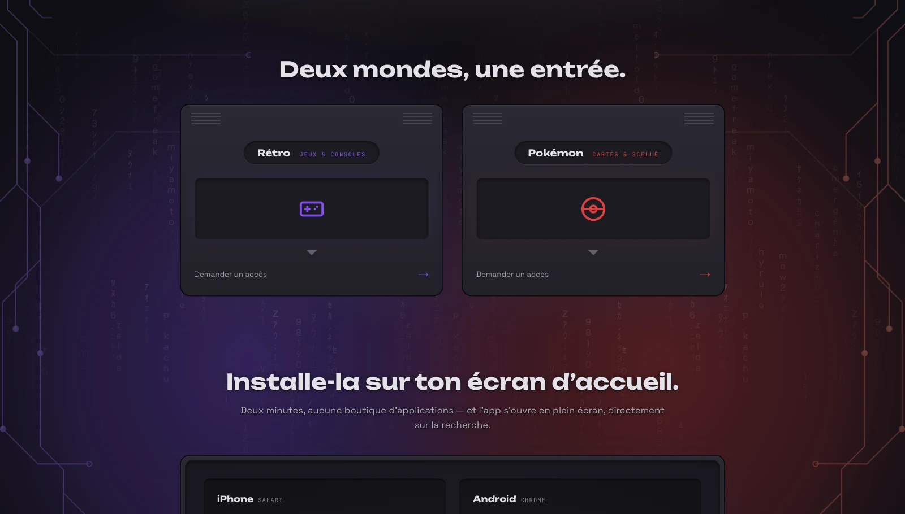
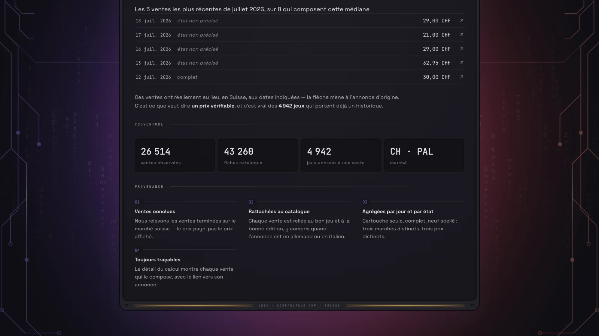
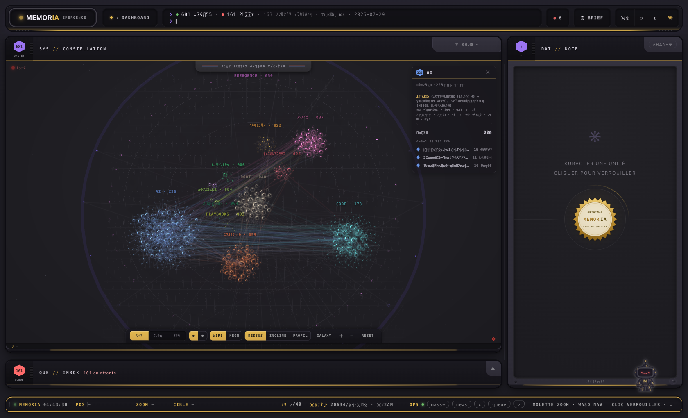
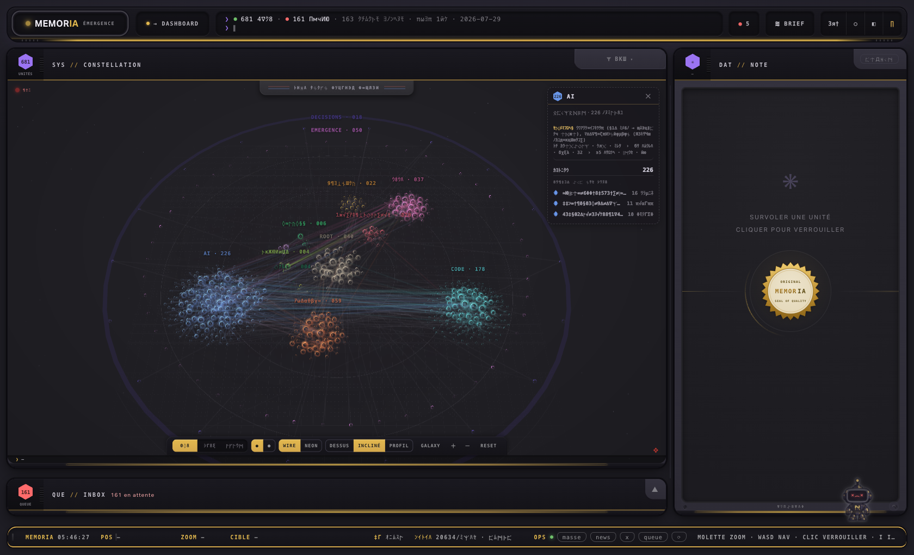
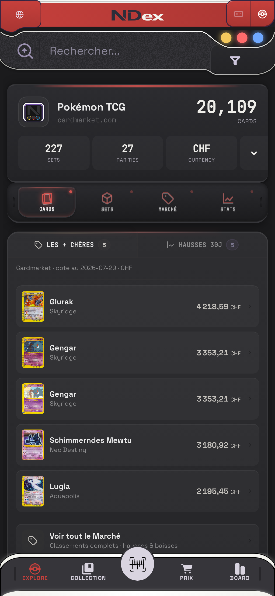
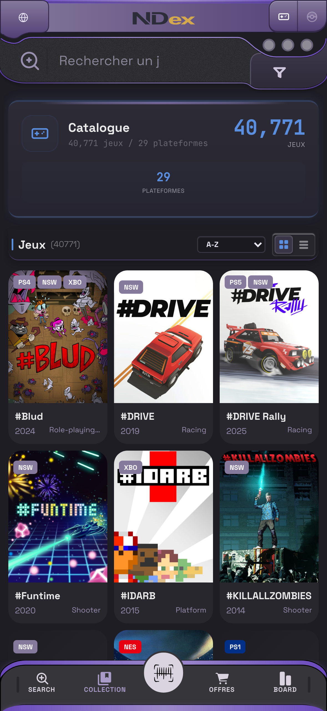

# Retromorphism

**A UI that behaves like a device, not like paper.**

Not skeuomorphism — nothing here pretends to be leather or brushed steel. Not
neumorphism — no soft extruded blobs, no shadow-only hierarchy. The premise is
narrower and older: a screen is a **panel set into a moulded shell**. It has
frames, notches, status lights and a bezel, and depth comes from structure
rather than from blur.

Every value in this repository was read out of two codebases that use it, not
picked for a palette.

## One language, two dialects

Retromorphism was born on **NDEX** — a Swiss price index for retro games and
Pokémon cards — and later adopted by **Memoria**, an instrument that shows the
shape of a knowledge base. A design language that only ever dressed the product
it was made for has proved nothing; this one survived a port to an appliance of
a different nature, and it did not survive unchanged.

So the repository is in two layers:

- **The core** — what both codebases resolve to the same value: the palette,
  four principles, seventeen rules. Mechanics, not a look.
- **The dialects** — where the two appliances legitimately differ. Neither is
  a drift to be corrected: a language that produces only one device is a
  template.

### The origin, live

Captured from [nd-x.app](https://nd-x.app) on 2026-08-01, phone width, dark
system preference — the site serves its light canvas anyway, by choice.

| Search hub | A title | Consoles |
|---|---|---|
|  |  |  |

### The shopfront

The landing at [nd-x.app](https://nd-x.app) speaks the language at marketing
scale — captured 2026-08-07. The cartridge logo is set into a moulded bezel
with its three diodes; the circuit engraving in the margins is drawn by hand,
not generated; and both shells sit in the same frame, one hue apart.



| Two worlds, one entry — the hue swap alone | The proof panel — an instrument publishing its coverage |
|---|---|
|  |  |

The page closes on a seal — *built with assayer*, the adopter's engine,
public at [Yyunozor/assayer-memory-mcp](https://github.com/Yyunozor/assayer-memory-mcp).

### The adopter



Its engine ships in public as
[assayer](https://github.com/Yyunozor/assayer-memory-mcp) — the knowledge
base whose hub these panels belong to.

## The measured core

Thirteen values appear in both codebases at the same value, reached
separately over several months — six light, seven dark. The dark ones are the
stronger signal: dark palettes are where most systems drift apart. Read on
2026-08-01 from source and computed styles on both sides
(`contenu/scripts/memoria_theme.py` on the adopter's side), not retyped from
memory.

**Light**

| Token | Value | NDEX | Memoria |
|---|---|---|---|
| `--rm-amber` | `#E2B84E` | `retro-accent` | `--amber` |
| `--rm-violet-muted` | `#7C6B9E` | `accent-muted` | `--accent` |
| `--rm-ink` | `#2A2832` | `text-1` | `--text` |
| `--rm-ink-muted` | `#5A5370` | `text-3` | `--muted` |
| `--rm-ink-faint` | `#7C7890` | `text-2` | `--faint` |
| `--rm-rule` | `#A8A0BC` | `border-2` | `--line` |

**Dark**

| Token | Value | NDEX | Memoria |
|---|---|---|---|
| `--rm-bg-dark` | `#1E1D24` | `app-bg` | `--bg` |
| `--rm-rule-dark` | `#4F4764` | `border-1` | `--line` |
| `--rm-rule-2-dark` | `#3A3845` | `border-2` | `--line2` |
| `--rm-accent-dark` | `#9B74F2` | `retro-accent` | `--accent` |
| `--rm-ink-dark` | `rgba(255,255,255,.90)` | `text-1` | `--text` |
| `--rm-gold` | `#D4A84C` | `accent-gold` | `--kraft` |
| `--rm-alert` | `#FF6B6B` | `diode-red` | `--warn` |

## Where the dialects part

Measured 2026-08-01, both codebases open side by side. Each side is right for
its appliance.

| Trait | NDEX (origin) | Memoria (adopter) |
|---|---|---|
| Frame | `1px solid #000` | `2px solid var(--outline)` |
| Diode | 16px, 8px gap | 6, 8 or 9px |
| Movement | diodes breathe (2000 ms loop) | chrome deliberately static |
| Hexagon | forbidden | carries the count |
| Corner radii | `6px 6px 14px 14px` on the tab bar | families of `16/16/22/22`, `18/18/12/12` |
| Default theme | light, served over a dark preference | dark |

Strip the colour, keep frames, grooves and radii, and ask whether it still
reads as one appliance: the answer is **two**. A language honest about that is
usable; one that hides it is a template that fits neither product.

## Four principles

**Matter over shadow.** Depth is surface levels and frames, never drop
shadows. NDEX inverts — dark shells *inside* a light canvas; Memoria stacks
dark on dark. Same principle, honoured by one appliance and set aside by the
other, for a reason each can state.

```
canvas #E3E0EA  ← the page
  s1   #D9D4E0  ← cards, panels
    s2 #36353A  ← dark shells: search, tabs, footer
      s3 #27262A ← grooves, dividers
```

**Two type registers, never three.** A grotesque to read; a monospace in
small caps, wide tracking, to label. The monospace label is what says
*instrument* rather than *website*.

**Asymmetric radii by position.** A module on the left is not a module on the
right — `16px 8px 32px 16px` on the left, `8px` in the centre, mirrored on
the right. The shell is moulded, not tiled.

**Status before text.** Diodes carry state at a glance; the label explains,
the diode is read first.

## Rules that cost something to learn

Seventeen, each recorded with what was tried first and why it failed.
→ [docs/rules.md](docs/rules.md)

A sample:

- **Cap the highlight.** A selected state never exceeds 1.4× resting
  luminance, and nothing flashes — an element that pulses is looked at once,
  then filtered out permanently.
- **Contrast by warmth, not brightness.** Lightening an element to detach it
  turns it into a sticker; detach it with warm rim-light and keep it dark.
- **Structural devices must encode something true.** Numbered markers only if
  the content is a sequence; a groove only where two modules actually meet.
- **Screens are the one place saturation is allowed.** Deep navy ground,
  phosphor text. Everywhere else, saturation is a mistake.

## Anatomy

Slot, module, diodes, moulded shell, identity zone, box variants — each
cropped from a running interface with the recipe that produces it, and the
five motifs that recur at every scale.
→ [docs/anatomy.md](docs/anatomy.md)


## Dark

Dark is where the language is most itself: the shell recedes, the screens
carry the signal, the diodes do the talking.

| Memoria | NDEX · Pokémon | NDEX · Games |
|---|---|---|
|  |  |  |

## Files

```
tokens/core.json     the measured core, W3C design-tokens shape
tokens/themes.json   per-product, per-theme values
tokens/core.css      custom properties, written alongside core.json
docs/anatomy.md      the six pieces, each with its recipe
docs/rules.md        seventeen rules, each with the failure that produced it
docs/principles.md   what this is and is not
docs/agentic.md      what an agent reproduces from sources alone — and what it loses
```

## Take it

The tokens are MIT. Copy them, fork them, ship them in something of your own.
What is worth keeping is the vocabulary — named values, the reasons behind
them, a date. If you build something in this language, `retromorphism` is
what to call it.

Both codebases are private: the tokens travel, the implementations do not.
That is the limit of what this repository can show, and it is stated rather
than implied.

— Yyunozor. Named February 2026; extracted 2026-07-29.
