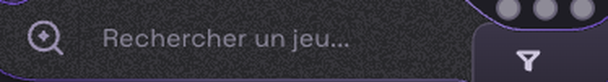
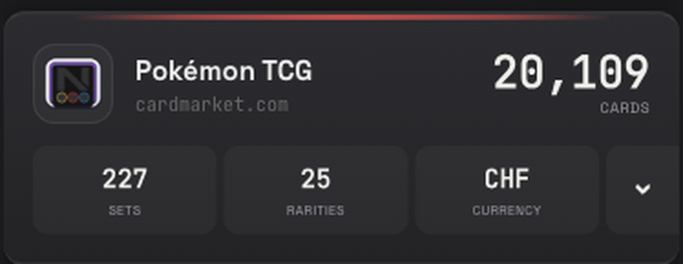
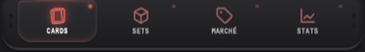
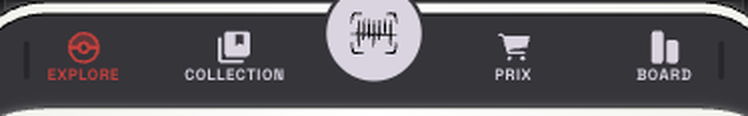
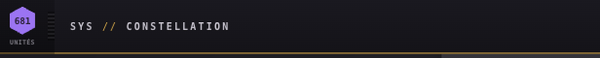
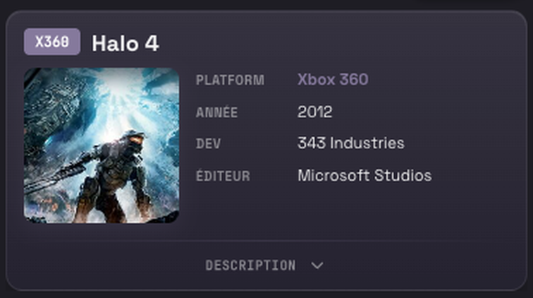
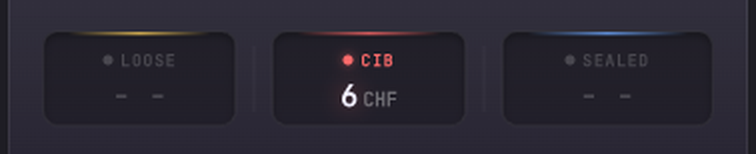
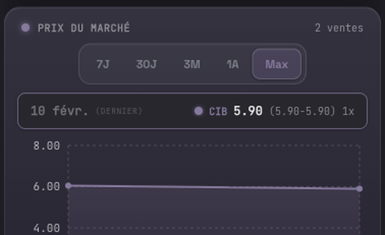

# Anatomy

Six pieces, a set of containers, and five motifs. Each is cropped from a running
interface and followed by the recipe that produces it — nothing is drawn for the
occasion.

---

## 1. The slot

A dark input recessed into a light shell, with an accent rail marking the seam.
This is the piece that decides whether a page reads as a *device* or as a
document, and it is the one most often got wrong: the inversion has to be
shell-light / screen-dark, not the reverse.


The same slot, games tint. Only the hue moves — radius, height, rail width and
type are untouched:



```css
.slot {
  background: var(--rm-surface-s3);
  border: var(--rm-border);
  border-radius: 999px 999px 14px 999px;   /* asymmetric: it is moulded */
  box-shadow: inset 0 2px 5px rgb(0 0 0 / .45);
  /* the rail is the seam between shell and screen, never decoration */
  border-bottom: 2px solid var(--rm-accent);
}
```

A grain texture sits on the dark surface at very low opacity. It is what keeps a
large dark area from reading as a flat hole, and it is the one place a texture
is allowed.

---

## 2. The module

A panel carrying counters, with the reading face for figures and the monospace
label underneath. Depth comes from a 1px frame and a surface level, never from a
drop shadow.



```css
.module {
  background: linear-gradient(180deg, var(--rm-surface-s2), var(--rm-surface-s3));
  border-top: 2px solid var(--rm-rule);
  border-bottom: 2px solid var(--rm-rule);
  border-radius: var(--rm-radius-center);
}
.module .value { font: 700 22px/1 var(--rm-font-body); font-variant-numeric: tabular-nums; }
.module .label { font: 600 9.5px/1 var(--rm-font-label);
                 letter-spacing: .18em; text-transform: uppercase;
                 color: var(--rm-ink-faint); }
```

**Sides are left open on purpose.** Once several of these stack, full side
strokes read as clutter; the top and bottom rules are enough to say *panel*.

`tabular-nums` prevents counters from shifting the layout when their value
changes.

---

## 3. Diodes

Status, read before any text. Twelve pixels, eight apart, with a glow of the
same hue. The label explains what the colour already said.



```css
.diode { width: 12px; height: 12px; border-radius: 50%;
         border: 1px solid rgb(0 0 0 / .45); }
.diode--gold { background: var(--rm-diode-gold); box-shadow: 0 0 7px var(--rm-diode-gold); }
.diode--red  { background: var(--rm-diode-red);  box-shadow: 0 0 7px var(--rm-diode-red); }
.diode--blue { background: var(--rm-diode-blue); box-shadow: 0 0 7px var(--rm-diode-blue); }
.diode--off  { background: var(--rm-diode-off); }   /* no glow when off */
```

The *off* state carries no glow. A dimmed glow reads as a fault; its absence
reads as inactive.

---

## 4. The moulded shell

The bottom bar is the base of the case rather than a strip: a notch for the
primary control, a light rim, and radii that differ left to right.



```css
.shell-bottom {
  background: linear-gradient(180deg, #DBD7E3, #D5D1DD);
  border-top: 2px solid var(--rm-rule);
  border-bottom: 2px solid var(--rm-rule);
  /* side notches read as the lateral edge — a full border on top of them
     doubles up and the case looks printed rather than moulded */
}
```

---

## 5. The identity zone

Every panel opens with a coloured hexagon carrying a count, a three-letter tag
beneath it, and a title in monospace small caps. Same anatomy in both codebases,
which is the clearest sign the language is shared rather than similar.



```css
.panel-bar .title { font: 600 10px/1 var(--rm-font-label);
                    letter-spacing: .22em; text-transform: uppercase; }
.panel-bar .tag   { font: 700 6.5px/1 var(--rm-font-label);
                    letter-spacing: .04em; text-transform: uppercase; }
```

The tag is 6.5px: a serial number on a case rather than a label to read.


---

## 6. Box variants

The same grammar produces several kinds of container. Three from one screen:

**Identity card.** Cover art, then key–value rows where the key is a monospace
label and the value is the reading face. The badge carries the platform.



**Tiered readout.** Three price states side by side, each capped with a rail in
its own diode hue and carrying the matching dot. This is the diode language
applied to a container rather than to a light — the rail says *which state* and
the dot repeats it at the point where the eye lands.



```css
.tier            { background: var(--rm-surface-s3); border: var(--rm-border);
                   border-radius: 10px; }
.tier--loose     { border-top: 2px solid var(--rm-diode-gold); }
.tier--cib       { border-top: 2px solid var(--rm-diode-red); }
.tier--sealed    { border-top: 2px solid var(--rm-diode-blue); }
```

**Series box.** Segmented control, a single-line readout of the last point, then
the plot. The readout exists so the chart never has to be interrogated for the
one number people actually came for.



The three share a frame and a surface level and differ only in what they carry.
The test of a box family: a variant that needs a new radius or a new border
weight is a second family, not a variant.

---

## 7. More containers

**Tabbed panel.** Tabs across the top of a box rather than above it, each with a
count badge, and the active one marked by a fading rail (motif 1 below) plus a
7% tint of the accent. The accent is not baked in — it arrives per instance as a
custom property, so one component serves every context without a new class.

```css
.panel        { --accent: #7C6B9E; }          /* set per instance */
.panel .tab            { background: transparent; }
.panel .tab[aria-selected="true"] {
  background: color-mix(in srgb, var(--accent) 7%, transparent);
  border-right: 1px solid color-mix(in srgb, var(--accent) 8%, transparent);
}
```

**Drawer hanging from the shell.** Rounded on the bottom only, because it
descends from the case rather than floating on the page. Carries the full
moulding treatment: cast shadow, bevel pair, and the double frame (motifs 2 and
3).

**Category tile.** A fading rail on top, an icon in a square tinted at 8% of its
own hue, a label, a monospace caption, and a glowing dot beneath. Each tile owns
a hue and nothing else changes.

```css
.tile .dot {
  width: 6px; height: 6px; border-radius: 50%;
  background: var(--hue);
  box-shadow: 0 0 6px var(--hue), 0 0 10px var(--hue);   /* two radii, not one */
}
```

Two shadow radii rather than one wider blur: the tight radius reads as the lamp,
the wide one as its halo.

**Section divider.** A label flanked by two hairlines that fade outward. It
separates without drawing a line across the layout.

```css
.divider .rule {
  height: 1px; flex: 1;
  background: linear-gradient(90deg, transparent, rgba(196,192,212,.5), transparent);
}
```

**Sticky group header.** Rounded on the bottom only — same reason as the drawer.
A 2px vertical accent bar opens the row, then title, count, actions, and a
segmented view toggle.

---

## Motifs

Pieces and containers alone are a component list. What makes this a language is
that the same few moves recur at every scale.

### 1. The fading rail

`linear-gradient(90deg, transparent, <hue>, transparent)`, 1 to 2px tall. It is
the active-tab marker, the top edge of a tile, and the section divider — three
roles, one gesture. A solid rail would read as a border; fading at both ends
makes it a *mark* rather than an edge, which is why it can sit inside a box
without competing with the box's own frame.

### 2. The tint ladder

One hue drives an entire component through opacity steps, and the steps are
consistent across the system:

| step | role |
|---|---|
| 7–8% | selected background, icon well |
| 10–13% | badge fill, thumbnail well |
| 16–18% | badge border, active outline |
| 33% | quick-action border |
| 56% | fading rail at its peak |

None of these is a new colour. A component that needs another grey has usually
skipped a step it could have reused.

### 3. The double frame

An outer border, then a second one inset by 2px with a radius 2px smaller.

```css
.shell        { border: 1px solid #6E5D97; border-radius: 0 0 16px 16px; }
.shell::after { content: ""; position: absolute; inset: 2px;
                border: 1px solid rgba(178,163,210,.35);
                border-radius: 0 0 14px 14px; pointer-events: none; }
```

The most characteristic move of the style. One frame reads as a plain box; two
frames at slightly different radii read as a moulded shell with an inner lip.
The radius must shrink with the inset, or the two curves conflict — see rule
13.

### 4. The bevel pair

```css
box-shadow: inset 0  1px 0 rgba(244,238,255,.24),   /* light catching the top */
            inset 0 -1px 0 rgba(0,0,0,.34);         /* shade at the bottom */
```

One line of light on the upper edge, one of shade on the lower — that is the
entire treatment. A blur turns it into a glow; a third line turns it into a
1990s bevel.

### 5. Asymmetric radii by position

A module on the left is not a module on the right. `16px 8px 32px 16px` on the
left of a group, `8px` in the middle, mirrored on the right. The case is moulded
in one piece, so its corners are not interchangeable.

---

## What holds it together

Strip every colour and keep the frames, grooves and radii. If the result still
reads as a device, the structure carries it. If it collapses into rectangles,
the colour was carrying it.
